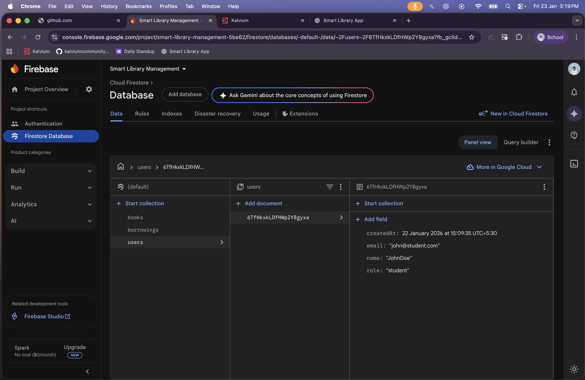
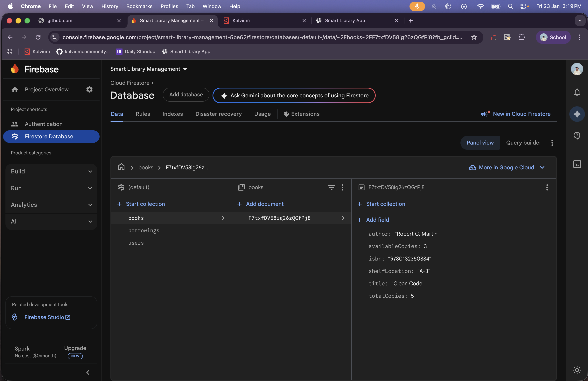
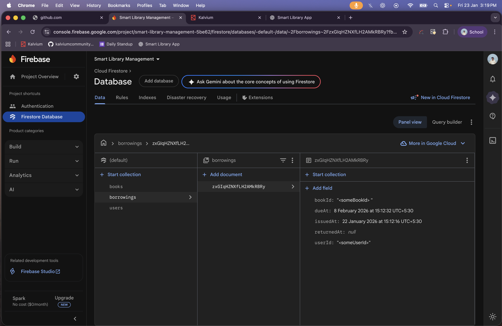

# Concept 1 : Flutter & Dart Fundamentals – Reactive UI Assignment

## Project Overview
This project demonstrates the core fundamentals of Flutter and Dart with a focus on Flutter’s widget-based architecture, reactive rendering model, and efficient state management. The application is a simple counter app used to explain how Flutter builds and updates UI efficiently across Android and iOS using a single codebase.

The assignment highlights how Flutter ensures smooth cross-platform UI performance by rebuilding only the necessary parts of the widget tree when application state changes.

---

## Flutter Architecture

Flutter is built on a layered architecture that enables high-performance, consistent UI rendering across platforms.

### Framework Layer (Dart)
This is the layer where application code is written. It contains:
- Material and Cupertino widgets
- Animation and rendering libraries
- State management logic

### Engine Layer (C++)
The engine is responsible for:
- Rendering UI using the Skia graphics engine
- Handling text layout, rasterization, and composition
- Managing Dart runtime execution

### Embedder Layer
The embedder connects Flutter to platform-specific APIs on Android and iOS, handling:
- Input events
- Application lifecycle
- Rendering surfaces

Flutter does not rely on native UI components. Instead, it renders everything itself, ensuring pixel-perfect consistency across platforms.

---

## Widget-Based Architecture

In Flutter, everything is a widget:
- Text
- Buttons
- Layouts
- Entire screens

Widgets are immutable descriptions of the UI. Flutter builds a widget tree to represent the UI hierarchy. When state changes, Flutter efficiently rebuilds only the affected widgets instead of updating the entire screen.

This declarative approach makes UI updates predictable and performant.

---

## StatelessWidget vs StatefulWidget

### StatelessWidget
A `StatelessWidget` is used when the UI does not change during runtime.

**Usage in this app:**
- Root application widget
- Static UI elements such as titles

Example:
```dart
class MyApp extends StatelessWidget {
  @override
  Widget build(BuildContext context) {
    return MaterialApp(
      home: CounterScreen(),
    );
  }
}
```
Once built, a StatelessWidget remains unchanged unless its parent rebuilds with new data.

⸻

### StatefulWidget

A StatefulWidget is used when the UI depends on changing data.

Usage in this app:
	•	Counter value displayed on the screen

Example:
```
class CounterScreen extends StatefulWidget {
  @override
  State<CounterScreen> createState() => _CounterScreenState();
}
```

The mutable state is stored separately in a State object, allowing Flutter to manage UI updates efficiently.

⸻

### Reactive UI and setState()

Flutter follows a reactive rendering model. When the application state changes, the UI automatically updates to reflect the new state.

In this app, pressing the floating action button increments a counter. This update is triggered using setState():

```

void incrementCounter() {
  setState(() {
    count++;
  });
}
```


Calling setState():
	•	Notifies Flutter that the widget’s state has changed
	•	Triggers a rebuild of only the affected widget subtree
	•	Avoids unnecessary UI redraws

This ensures smooth animations and consistent frame rates.

⸻

## Case Study: The Laggy To-Do App

### Problem Analysis

In the TaskEase To-Do app scenario, UI lag occurs due to:
-  State being managed too high in the widget tree
- Entire screens rebuilding on minor state changes
- Deeply nested widgets rebuilding unnecessarily
- Poor separation of static and dynamic widgets

These issues lead to frame drops and sluggish performance, especially on iOS.

⸻

## How Flutter Prevents Performance Issues

### Efficient Widget Rebuilding

Flutter rebuilds only the widgets affected by a state change. By placing state close to where it is used, unnecessary rebuilds are avoided.

### Proper State Control

In this app, only the counter widget rebuilds when the counter changes. Static widgets such as the AppBar remain unaffected.

### Dart’s Async Model

Dart’s async and await mechanisms allow long-running tasks to execute without blocking the UI thread, maintaining responsiveness and smooth animations.

⸻

## Cross-Platform Performance Benefits

Flutter ensures consistent performance across Android and iOS by:
	•	Using a single rendering engine (Skia)
	•	Avoiding platform-specific UI inconsistencies
	•	Applying the same widget tree and rendering logic across platforms
	•	Updating UI reactively instead of imperatively

This design allows Flutter apps to maintain stable frame rates and a smooth user experience across devices.

⸻

## Conclusion

This project demonstrates how Flutter’s widget-based architecture and Dart’s reactive rendering model enable:
	•	Efficient UI updates
	•	Predictable state management
	•	Smooth animations
	•	Consistent cross-platform performance

By rebuilding only what is necessary and managing state correctly, Flutter applications can scale while remaining responsive and performant.

⸻

## Assignment: Firestore Collections & Relations Design

### What We Did

Designed the Firestore database schema for the Smart Library Management Mobile App using production-level NoSQL best practices.

⸻

## Collections Created

1. books
	- Stores book details and inventory
	- Fields: title, author, isbn, shelfLocation, totalCopies, availableCopies

2. users
	- Stores user profile information
	- Fields: name, email, role, createdAt

3. borrowings
	- Tracks book issue/return transactions
	- Fields: bookId, userId, issuedAt, dueAt, returnedAt

⸻

🔗Relationships
- borrowings.userId → references users
- borrowings.bookId → references books
- No joins; relationships handled using document IDs (Firestore best practice)

⸻

Design Rationale
-  Flat, scalable Firestore structure
- Optimized for mobile queries
- Avoids deep nesting
- Easy to extend with Cloud Functions and Firestore Rules

```
⸻

⚖️ MERN Comparison
	•	MongoDB collections → Firestore collections
	•	ObjectId references → Document ID references
	•	Express APIs → Cloud Functions

⸻
```

## Proof of Work

Screenshots attached showing:
- books collection
- borrowings collection
- users collection

## 📸 Firebase Firestore – Proof of Work

### 📚 Books Collection


### 🔄 Borrowings Collection


### 👤 Users Collection



⸻

Status
```
✔ Collections designed
✔ Relations defined
✔ Data verified in Firebase Console
```

⸻
## 🎨 Design System & Theme Configuration (Flutter)
### Overview

As part of improving UI consistency and scalability, a centralized design system has been defined and integrated into the application using Flutter’s ThemeData.
This ensures a uniform visual language across the app while keeping the widget code clean and maintainable.

The design system abstracts colors, typography, and spacing into reusable tokens that are applied globally.

---

### 🎯 Design System Components
### Color System

#### A structured color palette has been created to avoid hard-coded values and enforce consistency.

Includes:

- Primary & secondary colors

- Background and surface colors

- Text colors

- Semantic colors (error, success, warning)
	- All colors are defined in a single source and consumed via the app theme.

---

### Typography System

Typography styles are standardized and mapped to Flutter’s TextTheme.

Defined text styles include:

- Headings

- Body text

- Labels and captions

This allows text styling to be reused consistently using:

```dart
Theme.of(context).textTheme
````
## Day-29
Discussion of App Design How it works like wireframes along with low fid and high fid design 
